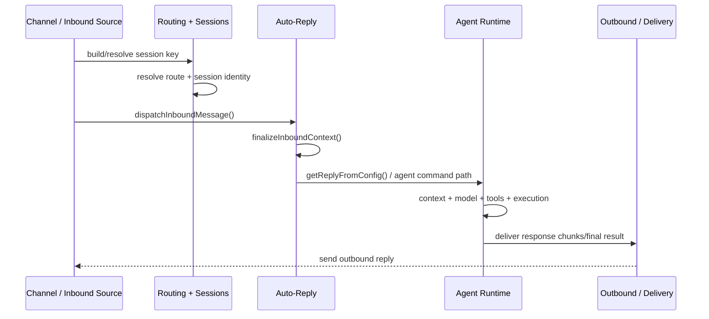
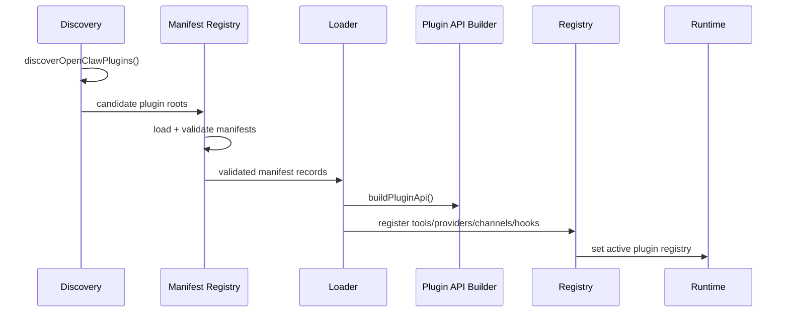
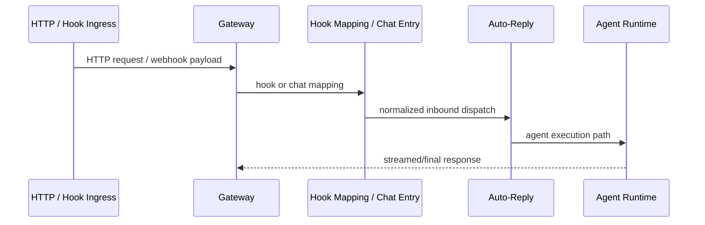
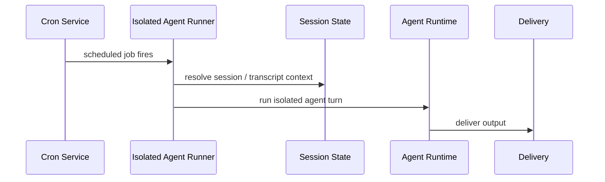

# OpenClaw 执行链与时序文档 / OpenClaw Execution Flows

这份文档专门不按“目录”讲，而按 **执行链** 讲。它回答的是：

- 一条入站消息到底怎样走到最终回复？
- 一个插件到底怎样从目录里的 manifest 走到运行时 registry？
- 哪些 handoff 是系统最关键的接缝？

This document is organized by **execution flow**, not by directory. It answers how an inbound message becomes a final reply, how a plugin becomes an active runtime capability, and which handoffs are the most critical seams.

---

## 一、阅读说明 / How to Read This Document

建议把这篇文档和以下几篇配合着看：

- `openclaw-gateway-deep-dive.md`
- `openclaw-sessions-routing-auto-reply-deep-dive.md`
- `openclaw-agents-deep-dive.md`
- `openclaw-plugin-system-deep-dive.md`

This document works best when read together with the Gateway, Sessions/Routing/Auto-Reply, Agent Runtime, and Plugin System deep dives.

---

## 二、核心执行链总览 / Core Execution Flows Overview

这篇文档重点讲四条链：

1. **Inbound Message → Route/Session → Auto-Reply → Agent Run → Outbound Reply**
2. **Plugin Discovery → Manifest Validation → Loader → Registry Activation**
3. **Gateway HTTP / Hook → Agent Execution**
4. **Cron Job → Isolated Agent Turn → Delivery**

The main focus is on four flows: inbound message to outbound reply, plugin activation, Gateway request to agent execution, and cron job to isolated agent turn.

---

## 三、执行链 1：Inbound Message → Route/Session → Auto-Reply → Agent Run → Outbound Reply

## 关键文件 / Key Files

| 角色 / Role | 文件 / File | 说明 |
| --- | --- | --- |
| Channel ingress | `src/channels/session.ts` | 记录入站会话与消息元数据 |
| Session key logic | `src/routing/session-key.ts` | 构建结构化 session key |
| Session key parse | `src/sessions/session-key-utils.ts` | 解析 session key 语义 |
| Route resolution | `src/routing/resolve-route.ts` | 决定 agentId / sessionKey / mainSessionKey |
| Auto-reply entry | `src/auto-reply/dispatch.ts` | auto-reply 分发总入口之一 |
| Inbound normalization | `src/auto-reply/reply/inbound-context.ts` | 规范化 inbound context |
| Reply assembly | `src/auto-reply/reply.ts` | reply runtime 的总装配入口 |
| Agent execution | `src/agents/agent-command.ts` | Agent Runtime 主入口之一 |
| Delivery | `src/agents/command/delivery.ts` | 结果交付与输出落地 |

## Mermaid 时序图 / Mermaid Sequence Diagram

## 逐步解释 / Step-by-Step Explanation

### 第 1 步：消息进入 / Step 1: message enters

外部消息可能来自 Telegram、Discord、Feishu、CLI、Hook 或其他接入面。进入系统后，首先需要被表达成 OpenClaw 可识别的 inbound context。

An external message may arrive from Telegram, Discord, Feishu, CLI, hooks, or other ingress surfaces. It first needs to become an OpenClaw-compatible inbound context.

### 第 2 步：路由和会话绑定 / Step 2: routing and session binding

这一阶段由 `session-key.ts`、`session-key-utils.ts`、`resolve-route.ts` 等文件支撑。系统要决定：

- 归哪个 agent
- 落哪个 session
- mainSessionKey 是什么
- last-route policy 是什么

This stage decides agent ownership, session identity, main session semantics, and last-route policy.

### 第 3 步：auto-reply 入口 / Step 3: auto-reply ingress

`dispatch.ts` 是 auto-reply 的主要门口之一。它先做 inbound context finalize，再把工作交给 reply pipeline。

`dispatch.ts` is a main door into auto-reply. It first finalizes inbound context, then hands the work to the reply pipeline.

### 第 4 步：Agent Runtime 执行 / Step 4: agent runtime execution

进入 reply runtime 之后，系统开始进入真正的 Agent 执行面：

- context 组装
- model 选择
- auth profile 选择
- tools 注入
- tool execution
- stream/final output

At this stage the system enters real agent execution: context assembly, model selection, auth profile choice, tool injection, tool execution, and streamed/final output.

### 第 5 步：输出回流 / Step 5: outbound return path

结果最终通过 delivery / outbound surfaces 返回给原来的 channel / client / node。

The result finally returns through delivery and outbound surfaces to the original channel, client, or node.

## 为什么这条链重要 / Why This Flow Matters

这条链几乎就是 OpenClaw 最核心的“活着的主路径”。

This is almost the most essential live path in OpenClaw.

---

## 四、执行链 2：Plugin Discovery → Manifest Validation → Loader → Registry Activation

## 关键文件 / Key Files

| 角色 / Role | 文件 / File | 说明 |
| --- | --- | --- |
| Discovery | `src/plugins/discovery.ts` | 扫描候选插件 |
| Manifest model | `src/plugins/manifest.ts` | manifest 结构与约束 |
| Manifest registry | `src/plugins/manifest-registry.ts` | 验证并生成 registry 记录 |
| Validation | `src/plugins/schema-validator.ts` | config/schema 校验 |
| Loader | `src/plugins/loader.ts` | discovery → validation → module load → register 的主链 |
| API surface | `src/plugins/api-builder.ts` | 构建给插件的宿主 API |
| Registry | `src/plugins/registry.ts` | 汇总 tool/provider/channel/hook/service 等能力 |
| Runtime activation | `src/plugins/runtime.ts` | active registry 等运行态 |
| SDK boundary | `src/plugin-sdk/index.ts` | 公共 SDK 根入口 |

## Mermaid 时序图 / Mermaid Sequence Diagram

## 逐步解释 / Step-by-Step Explanation

### 第 1 步：插件发现 / Step 1: discovery

`discovery.ts` 负责扫描不同来源（bundled / workspace / global）并找出 candidate plugins。

`discovery.ts` scans different origins (bundled, workspace, global) to find candidate plugins.

### 第 2 步：manifest-first 验证 / Step 2: manifest-first validation

OpenClaw 的设计重点是：先读 manifest，先做 schema/contract 验证，再决定是否执行模块代码。

The key design principle is manifest-first validation before executing plugin module code.

### 第 3 步：装载与 API 构建 / Step 3: loading and API construction

`loader.ts` 协调整条主链，并通过 `api-builder.ts` 组装插件看见的 `OpenClawPluginApi`。

`loader.ts` coordinates the main chain and uses `api-builder.ts` to construct the `OpenClawPluginApi` seen by plugins.

### 第 4 步：注册与激活 / Step 4: registration and activation

插件能力最终被写进统一 registry，然后由 runtime 层激活。插件并不是“单独工作”，而是“进入宿主能力总账”。

Capabilities are written into a unified registry and then activated by the runtime layer. Plugins do not “work alone”; they enter the host capability ledger.

## 为什么这条链重要 / Why This Flow Matters

这条链解释了 OpenClaw 为什么不是“插件随便 import 就完了”，而是一个带秩序的宿主系统。

This flow explains why OpenClaw is not “just import plugins however you like,” but an ordered host system.

---

## 五、执行链 3：Gateway HTTP / Hook → Agent Execution

## 关键文件 / Key Files

| 文件 / File | 说明 |
| --- | --- |
| `src/gateway/server-http.ts` | HTTP / HTTPS 入口总装配 |
| `src/gateway/hooks.ts` | hook payload 和 dispatch 逻辑 |
| `src/gateway/hooks-mapping.ts` | hook 映射与规则 |
| `src/gateway/server-chat.ts` | Gateway 侧 chat 入口 |
| `src/auto-reply/dispatch.ts` | auto-reply 分发 |
| `src/agents/agent-command.ts` | agent runtime 入口 |

## Mermaid 时序图 / Mermaid Sequence Diagram

## 为什么这条链重要 / Why This Flow Matters

这条链说明 Gateway 不只是 API server，它还是“把外部请求导入到 Agent Runtime 的控制面总线”。

This flow shows that Gateway is not just an API server; it is also the control-plane bus that imports external requests into the Agent Runtime.

---

## 六、执行链 4：Cron Job → Isolated Agent Turn → Delivery

## 关键文件 / Key Files

| 文件 / File | 说明 |
| --- | --- |
| `src/cron/service.ts` | cron service 入口 |
| `src/cron/isolated-agent/run.ts` | 隔离 agent turn 执行 |
| `src/sessions/` | session state / transcript 相关支持 |
| `src/agents/agent-command.ts` | agent runtime 执行 |
| `src/agents/command/delivery.ts` | delivery 输出 |

## Mermaid 时序图 / Mermaid Sequence Diagram

## 为什么这条链重要 / Why This Flow Matters

这条链说明 OpenClaw 不是只能被动响应消息，它也能主动按计划执行 agent 工作。

This flow shows that OpenClaw is not only reactive; it can proactively execute agent work on schedule.

---

## 七、把四条链串起来看 / Reading the Four Flows Together

如果把这四条链放在一起，你会看到 OpenClaw 的运行特征：

- 消息型系统：inbound → reply
- 宿主型系统：plugin discovery → activation
- 控制面系统：HTTP / Hook → agent execution
- 自动化系统：cron → isolated agent turn

Together, these four flows reveal OpenClaw as a message-driven system, a plugin host, a control-plane system, and an automation platform.

---

## 八、如果你时间有限，最少读哪些 / Minimal Must-Read Set

如果你只有 2 小时，建议优先读这 8 个文件：

1. `src/routing/resolve-route.ts`
2. `src/auto-reply/dispatch.ts`
3. `src/agents/agent-command.ts`
4. `src/plugins/discovery.ts`
5. `src/plugins/manifest-registry.ts`
6. `src/plugins/loader.ts`
7. `src/gateway/server-http.ts`
8. `src/cron/isolated-agent/run.ts`

These eight files are enough to understand the most important live execution flows across inbound handling, plugin activation, Gateway ingress, and cron-driven execution.
