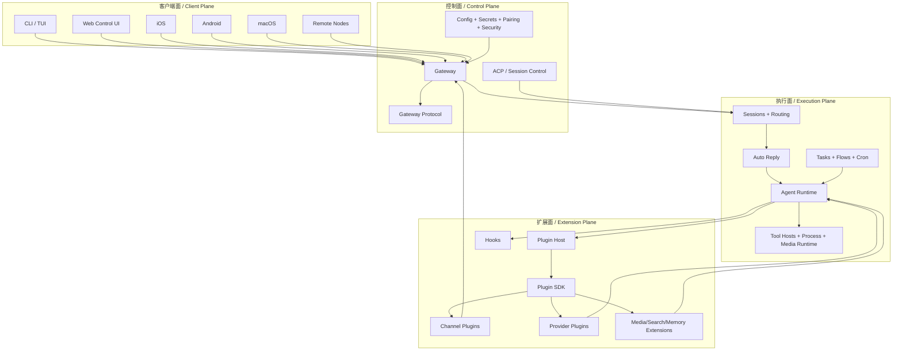
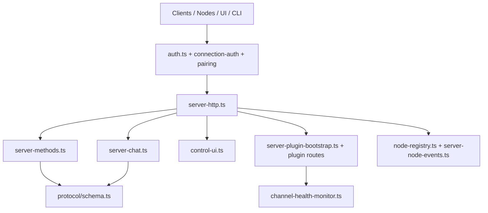
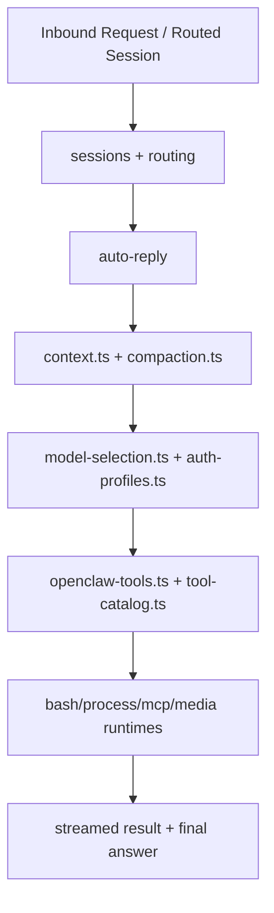
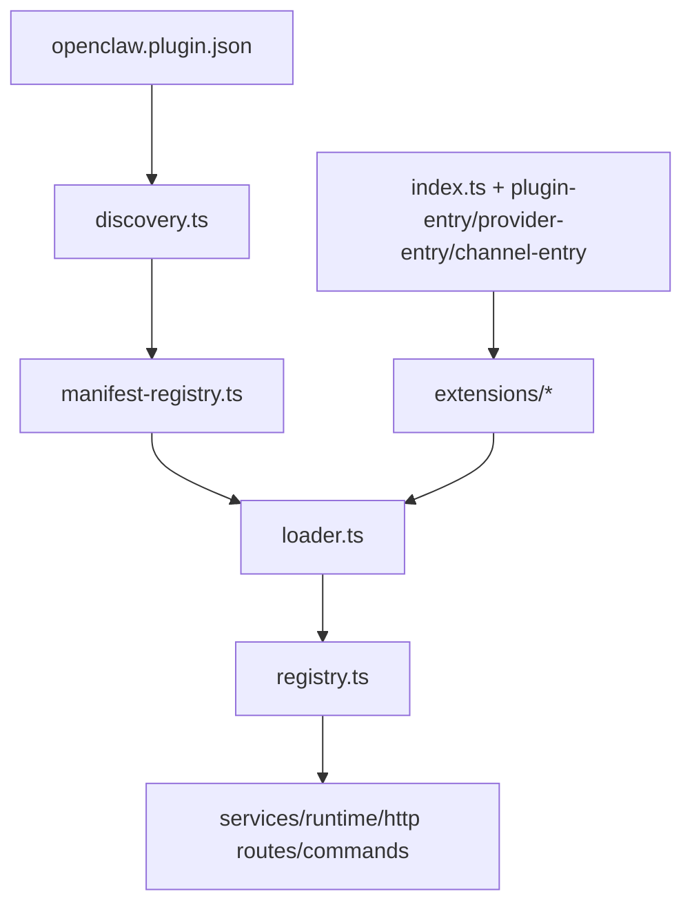

# OpenClaw 分层架构图版 / OpenClaw Layered Architecture

这份文档把 OpenClaw 拆成四层：

1. **控制面（Control Plane）**
2. **执行面（Execution Plane）**
3. **扩展面（Extension Plane）**
4. **客户端面（Client Plane）**

同时，不再只给一张总图，而是拆成四张图：

- 总图 / Overall system
- Gateway 图 / Gateway internals
- Agent Runtime 图 / Agent runtime internals
- Plugin System 图 / Plugin system internals

---

## 一、总图 / Overall Architecture



### 解释 / Explanation

- **客户端面** 负责人与设备接入。  
  The client plane is where humans and devices enter the system.

- **控制面** 负责 admission、认证、协议、配对、系统边界。  
  The control plane owns admission, auth, protocol, pairing, and the outer system boundary.

- **执行面** 负责真正跑一次 agent turn。  
  The execution plane performs the actual agent turn.

- **扩展面** 提供可插拔能力：channel、provider、media、memory、search。  
  The extension plane provides pluggable capabilities: channels, providers, media, memory, search.

---

## 二、Gateway 图 / Gateway Architecture



### Gateway 的核心职责 / Core Gateway Responsibilities

| 模块 / Module | 中文说明 | English note |
| --- | --- | --- |
| `boot.ts` | 启动控制逻辑，处理 boot session 与 BOOT.md 场景。 | Startup control logic including boot session handling. |
| `server-http.ts` | HTTP 外部总装配，挂载所有主要入口。 | Main external HTTP assembly point. |
| `auth.ts` | 处理认证与连接授权。 | Handles authentication and connection authorization. |
| `control-ui.ts` | 给浏览器 Control UI 提供页面与状态。 | Serves the browser Control UI. |
| `server-chat.ts` | 管 Gateway 侧聊天入口与事件。 | Gateway-side chat entry and event wiring. |
| `protocol/schema.ts` | 统一协议合同。 | Unified protocol contract. |
| `server-plugin-bootstrap.ts` | 把 plugin routes/services/methods 接进 Gateway。 | Connects plugin routes/services/methods into Gateway. |
| `node-registry.ts` | 移动端和节点能力注册。 | Registers node/mobile capabilities. |

### 这张图想表达什么 / What this diagram shows

Gateway 不是“一个 HTTP server 文件夹”，而是整个系统的 **控制面背板（control-plane backplane）**。

Gateway is not just “an HTTP server folder”; it is the control-plane backplane of the system.

---

## 三、Agent Runtime 图 / Agent Runtime Architecture



### Agent Runtime 的核心职责 / Core Agent Runtime Responsibilities

| 模块 / Module | 中文说明 | English note |
| --- | --- | --- |
| `src/sessions/` | 会话身份与 transcript 连续性。 | Session identity and transcript continuity. |
| `src/routing/` | 决定消息落到哪个 account/agent/session。 | Resolves account/agent/session ownership. |
| `src/auto-reply/` | 决定何时触发自动回复。 | Decides whether auto-reply should trigger. |
| `context.ts` | 构造当前回合上下文。 | Builds runtime context for the turn. |
| `compaction.ts` | 长会话压缩。 | Compacts long conversations. |
| `model-selection.ts` | 选择 provider/model。 | Selects provider/model. |
| `auth-profiles.ts` | 选择认证配置与 profile。 | Selects auth profile/runtime auth behavior. |
| `openclaw-tools.ts` | 暴露当前回合可用的工具。 | Exposes the tools available in the turn. |
| `tool-catalog.ts` | 维护工具目录与描述。 | Maintains tool catalog and metadata. |

### 这张图想表达什么 / What this diagram shows

Agent Runtime 的本质不是“调一个模型”，而是：

**会话上下文构造 + 模型选择 + 工具编排 + 结果流式输出**。

The agent runtime is not just “calling a model”; it is session-aware context assembly, model selection, tool orchestration, and streamed result generation.

---

## 四、Plugin System 图 / Plugin System Architecture



### Plugin System 的核心职责 / Core Plugin System Responsibilities

| 模块 / Module | 中文说明 | English note |
| --- | --- | --- |
| `discovery.ts` | 找到候选插件。 | Discovers candidate plugins. |
| `manifest-registry.ts` | 读取和缓存 manifest 元数据。 | Reads and caches manifest metadata. |
| `loader.ts` | 根据 manifest 与运行时策略装载插件模块。 | Loads plugin modules using manifest/runtime rules. |
| `registry.ts` | 汇总插件注册结果：tools、providers、channels、hooks、services、routes。 | Aggregates plugin registrations across tools/providers/channels/hooks/services/routes. |
| `plugin-sdk/index.ts` | 根级 SDK 对外面。 | Root public SDK surface. |
| `plugin-entry.ts` | 定义一般插件入口合同。 | General plugin entry contract. |
| `provider-entry.ts` | 定义 provider plugin 入口合同。 | Provider plugin entry contract. |
| `channel-entry-contract.ts` | 定义 channel plugin 入口合同。 | Channel plugin entry contract. |

### 这张图想表达什么 / What this diagram shows

插件系统的关键设计不是“动态 import 很多目录”，而是：

**先看 manifest，再做 enable/validate，再进 runtime registration。**

The key plugin-system design is not “just dynamic import many directories”, but **manifest-first discovery, validation, then runtime registration**.

---

## 五、四层归类表 / Four-Layer Placement Table

| 层 / Layer | 主要目录 / Main modules | 为什么放这里 / Why here |
| --- | --- | --- |
| 控制面 / Control Plane | `src/gateway/`, `src/acp/`, `src/config/`, `src/secrets/`, `src/security/`, `src/pairing/` | 负责 admission、协议、认证、治理与系统边界。 / Owns admission, protocol, auth, governance, and the outer system boundary. |
| 执行面 / Execution Plane | `src/agents/`, `src/sessions/`, `src/routing/`, `src/auto-reply/`, `src/tasks/`, `src/flows/`, `src/process/`, `src/cron/` | 负责真正执行 agent turn。 / Performs the actual runtime work. |
| 扩展面 / Extension Plane | `src/plugins/`, `src/plugin-sdk/`, `src/hooks/`, `src/channels/`, `extensions/`, `packages/plugin-package-contract`, `packages/memory-host-sdk` | 负责 pluggable capabilities。 / Owns pluggable capabilities. |
| 客户端面 / Client Plane | `src/cli/`, `src/tui/`, `ui/`, `apps/*`, `Swabble/` | 负责人与设备的入口。 / Owns human/device entry surfaces. |

---

## 六、跨层主链路 / Main Cross-Layer Flows

### 链路 1：操作员发起一次 agent run / Operator-initiated run

```text
客户端面 Client Plane
  -> 控制面 Control Plane
  -> 执行面 Execution Plane
  -> 扩展面 Extension Plane
  -> 结果再回到控制面与客户端面
```

### 链路 2：渠道收到一条消息 / Inbound channel message

```text
扩展面（channel plugin）
  -> 控制面（Gateway ingress + trust checks）
  -> 执行面（routing + sessions + auto-reply + agents）
  -> 扩展面（channel-specific outbound execution）
```

### 链路 3：移动节点能力调用 / Mobile node capability invocation

```text
客户端面（iOS / Android / macOS node）
  -> 控制面（Gateway connect + pairing）
  -> 执行面（agent decides action）
  -> 控制面（Gateway relay）
  -> 客户端面（node executes and returns result）
```

---

## 七、最容易混淆的模块 / Ambiguous Modules

| 模块 / Module | 为什么容易混淆 / Why ambiguous | 推荐展示位置 / Best placement |
| --- | --- | --- |
| `src/gateway/protocol/` | 同时被 client、gateway、runtime 消费。 / Consumed by clients, gateway, and runtime. | 放控制面。 / Show it in the control plane. |
| `src/sessions/` + `src/routing/` | 既像控制逻辑，又直接服务执行逻辑。 / Feels like control, but directly shapes execution. | 放执行面。 / Show it in the execution plane. |
| `src/channels/` | 既有 core 抽象，又和插件强相关。 / Mixes core abstractions and plugin-facing channel behavior. | 放扩展面。 / Show it in the extension plane. |
| `src/cli/` | 会触发执行，但本质是 operator entry surface。 / Triggers execution but is fundamentally an operator-facing entry surface. | 放客户端面。 / Show it in the client plane. |
| `src/hooks/` | 运行时会执行，但它是 extensibility seam。 / Executed at runtime, but architecturally it is an extensibility seam. | 放扩展面。 / Show it in the extension plane. |

---

## 八、结论 / Final Interpretation

把 OpenClaw 分成四层之后，很多复杂度会立刻变清楚：

- **控制面**：谁可以进入系统、如何被信任、如何被管理  
  **Control plane**: who may enter, how they are trusted, how the system is governed

- **执行面**：系统如何完成一次 agent turn  
  **Execution plane**: how the system completes one agent turn

- **扩展面**：系统能力如何被插件化扩展  
  **Extension plane**: how capabilities are extended via plugins

- **客户端面**：人和设备如何接触这套系统  
  **Client plane**: how humans and devices interact with the system

所以，从源码阅读的角度看，最有效的理解路径是：

**先看控制面，再看执行面，然后看扩展边界，最后看客户端表面。**

From a source-reading perspective, the most effective order is: **control plane first, execution plane second, extension seam third, client surfaces last.**
