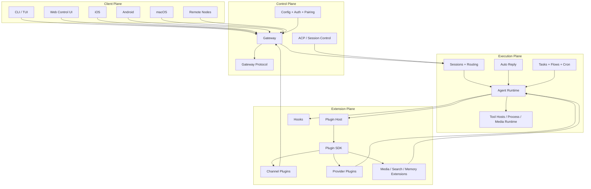

# OpenClaw Layered Architecture

This document presents OpenClaw as a four-layer system:

1. **Control plane**
2. **Execution plane**
3. **Extension plane**
4. **Client plane**

This is not the only valid cut, but it is the cleanest one for explaining how the repository behaves as a platform.

## Layer overview



## 1. Control plane

The control plane is the part of OpenClaw that owns system coordination, identity, protocol boundaries, configuration, and ingress.

### Main modules

| Module | Why it belongs here |
| --- | --- |
| `src/gateway/` | Primary control-plane daemon and ingress surface. |
| `src/gateway/protocol/` | Wire contract for clients and nodes. |
| `src/acp/` | Session control, runtime control, and operator/control abstractions. |
| `src/config/` | Configuration loading, validation, and runtime config state. |
| `src/secrets/` | Secret resolution for provider and runtime auth. |
| `src/security/` | Runtime audits, dangerous config/tool checks, and trust enforcement. |
| `src/pairing/` | Device identity and trust relationships. |

### Responsibilities

- accept and authenticate clients and nodes
- validate protocol frames and requests
- hold control-plane state
- expose health, status, and system routes
- load config and trust settings
- enforce pairing and ingress policy

### Why Gateway is here, not in execution

The Gateway triggers execution, but its primary job is orchestration and control-plane mediation. It owns the outer boundary of the running system.

## 2. Execution plane

The execution plane is the part that performs work once the control plane accepts it.

### Main modules

| Module | Why it belongs here |
| --- | --- |
| `src/agents/` | Core agent runtime and tool/model orchestration. |
| `src/sessions/` | Session identity, transcript state, and continuity. |
| `src/routing/` | Maps inbound requests to agent/session/account context. |
| `src/auto-reply/` | Turns inbound events into executable agent work. |
| `src/tasks/` | Structured runtime task management. |
| `src/flows/` | Higher-level execution orchestration. |
| `src/process/` | Tool hosts, child process supervision, PTY integration. |
| `src/cron/` | Scheduled execution and background work. |
| `src/media/`, `src/tts/`, `src/realtime-*`, `src/image-generation/`, `src/video-generation/` | Core-side execution support for multimodal operations. |

### Responsibilities

- build runtime context for an agent turn
- select model/provider/auth profile
- invoke tools and process hosts
- stream results and finalize outputs
- maintain session continuity across turns
- run task/flow-based execution logic

### Why sessions and routing live here

They are connected to control-plane identity, but their job is to make execution correct. They shape how a concrete run is instantiated, not how a client is admitted.

## 3. Extension plane

The extension plane is the pluggable capability layer. It is how OpenClaw stops being a closed runtime and becomes an ecosystem platform.

### Main modules

| Module | Why it belongs here |
| --- | --- |
| `src/plugins/` | Plugin discovery, validation, loading, and registry assembly. |
| `src/plugin-sdk/` | Public host contract for plugin authors. |
| `src/channels/` | Internal channel core that supports the wider extension model. |
| `src/hooks/` | Lifecycle extension points used by plugins and hook-based integrations. |
| `extensions/` | Bundled ecosystem of channels, providers, media, search, memory, and tooling plugins. |
| `packages/plugin-package-contract` | Internal package support for plugin packaging/contracts. |
| `packages/memory-host-sdk` | Shared support package for memory-related extension behavior. |

### Responsibilities

- discover and validate plugins from manifests
- expose stable SDK seams
- register capabilities into the runtime
- let channels, providers, and media/search/memory backends plug into the system
- keep host internals decoupled from extension-specific logic

### Important architectural idea

The extension plane is not just “extra features.” In OpenClaw, many first-class system capabilities are expected to arrive through plugins. The host is intentionally broad.

## 4. Client plane

The client plane contains the user- and device-facing surfaces that talk to the control plane.

### Main modules

| Module | Why it belongs here |
| --- | --- |
| `src/cli/` | Operator-facing command-line client surface. |
| `src/tui/` | Terminal UI and local operator interactions. |
| `ui/` | Browser-based Control UI. |
| `apps/android/` | Android client/node surface. |
| `apps/ios/` | iOS client/node surface. |
| `apps/macos/` | macOS app/client surface. |
| `apps/shared/OpenClawKit` | Shared Apple protocol/runtime/UI client library. |
| `Swabble/` | Apple-side wake-word/voice companion project. |

### Responsibilities

- provide chat and control interfaces
- connect to the Gateway over the public protocol
- expose device/node capabilities from mobile or desktop platforms
- render settings, session, node, and chat experiences

### Why CLI is placed here

The CLI does trigger execution, but architecturally it behaves as a control-plane client and operator surface. It is a front door into the system rather than the core execution engine itself.

## Cross-layer flows

## Flow 1: operator-initiated agent run

```text
Client plane (CLI / Web UI / macOS app)
  → Control plane (Gateway + protocol + auth)
  → Execution plane (sessions + routing + agents)
  → Extension plane (providers / tools / channels / hooks)
  → back through Gateway to the client
```

## Flow 2: inbound channel message

```text
Extension plane (channel plugin receives message)
  → Control plane (Gateway ingress and trust checks)
  → Execution plane (auto-reply + routing + session + agents)
  → Extension plane (channel-owned outbound execution)
  → external messaging platform
```

## Flow 3: native node capability call

```text
Client plane (iOS / Android / macOS node)
  → Control plane (Gateway WS connect + pairing)
  → Execution plane (agent decides to invoke node capability)
  → Control plane (Gateway relays request)
  → Client plane (node performs action and returns result)
```

## Ambiguous modules and how to present them

Some modules touch more than one layer. For a clear diagram, these are the best placements.

| Module | Touches | Best presentation |
| --- | --- | --- |
| `src/gateway/protocol/` | control + client + execution | Present in **control plane** because it is the authoritative contract boundary. |
| `src/sessions/` and `src/routing/` | control + execution | Present in **execution plane** because they shape concrete runtime work. |
| `src/channels/` | execution + extension | Present in **extension plane** because channel behavior is part of the pluggable capability surface. |
| `src/cli/` | client + control + execution | Present in **client plane** because it acts as an operator-facing entry surface. |
| `src/hooks/` | execution + extension | Present in **extension plane** because it is an extensibility seam, not the main runtime loop itself. |

## Formal dependency summary

The clean dependency direction is:

```text
Client plane
  → Control plane
  → Execution plane
  → Extension plane
```

But runtime reality includes controlled feedback loops:

- extension plane sends inbound events back into the control plane
- control plane relays node/device work back into the client plane
- execution plane consumes extension capabilities dynamically

So the real architecture is layered, but not strictly one-way in the runtime sense. The best mental model is:

- **control plane owns admission and coordination**
- **execution plane owns doing the work**
- **extension plane owns pluggable capabilities**
- **client plane owns human/device interaction**

## Final interpretation

This four-layer cut makes OpenClaw easier to reason about because it separates:

- the system boundary from the execution core
- the execution core from the capability ecosystem
- the capability ecosystem from the human/device entry surfaces

That framing is especially useful when planning changes, because it quickly reveals whether a change is:

- a control-plane problem
- an execution/runtime problem
- an extension-boundary problem
- or a client/product-surface problem
