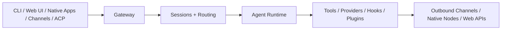

# OpenClaw 源码总体架构调研 / OpenClaw Source Architecture Survey

这份文档是整个 OpenClaw 调研仓库的**总览页**。它的目标不是穷举所有文件，而是先回答三个根问题：

1. **OpenClaw 从系统形态上到底是什么？**
2. **它的核心技术框架由哪些部分组成？**
3. **这些部分之间是怎样连起来的？**

This document is the **high-level survey** of the OpenClaw codebase. Its goal is not to enumerate every file, but to answer three fundamental questions: what OpenClaw is as a system, which major parts make up the framework, and how those parts connect.

## 快速跳转 / Quick Links

- 总索引与阅读路径 / Master index: [openclaw-doc-index-and-reading-paths.md](https://github.com/simonggx/openclaw-source-architecture-survey/blob/main/openclaw-doc-index-and-reading-paths.md)
- 执行链与时序 / Execution flows: [openclaw-execution-flows.md](https://github.com/simonggx/openclaw-source-architecture-survey/blob/main/openclaw-execution-flows.md)
- 源码导读 / Source guide: [openclaw-source-guide.md](https://github.com/simonggx/openclaw-source-architecture-survey/blob/main/openclaw-source-guide.md)
- 分层架构图 / Layered architecture: [openclaw-layered-architecture.md](https://github.com/simonggx/openclaw-source-architecture-survey/blob/main/openclaw-layered-architecture.md)

---

## 一、先给结论 / Executive Summary

一句话说，**OpenClaw 不是单一聊天应用，也不是简单的 CLI 包装器，而是一个以 Gateway 为中枢、以 Agent Runtime 为执行引擎、以 Plugin SDK 为扩展边界、以多端客户端和多渠道接入为产品表面的 AI 平台型系统。**

In one sentence: **OpenClaw is not a single chat app or a thin CLI wrapper. It is a Gateway-centered AI platform with an Agent Runtime execution core, a Plugin SDK extension boundary, and multiple client/channel product surfaces.**

更具体一点，OpenClaw 可以拆成四个最核心的层次：

1. **控制面 / Control Plane**：Gateway、协议、认证、配对、配置
2. **执行面 / Execution Plane**：Agents、Sessions、Routing、Auto-Reply、Tasks/Flows
3. **扩展面 / Extension Plane**：Plugins、Plugin SDK、Hooks、Extensions 生态
4. **客户端面 / Client Plane**：Web UI、iOS、Android、macOS、OpenClawKit、Swabble

---

## 二、从运行链看整体 / Runtime Spine at a Glance

下面这张总图是理解 OpenClaw 最有效的入口：

The following high-level flow is the most effective starting point for understanding OpenClaw.



这条链的意思是：

- 所有外部入口先进入 Gateway
- Gateway 不直接做全部工作，而是把上下文交给 Sessions/Routing
- Sessions/Routing 决定工作落到哪个会话和哪个 agent
- Agent Runtime 负责真正执行一次 agent turn
- 执行面再通过 plugins / tools / providers 等能力完成工作
- 最终结果再回到外部渠道、客户端或节点

This flow means that all ingress surfaces first enter the Gateway, then pass through session/routing resolution, then into the Agent Runtime, which in turn uses plugins, tools, and providers before returning results outward.

---

## 三、代码仓库形态 / Repository Shape

OpenClaw 是一个 `pnpm` monorepo。最关键的顶层目录可以这样看：

OpenClaw is a `pnpm` monorepo. The top-level directories can be interpreted like this:

| 路径 / Path | 角色（中文） | Role (English) |
| --- | --- | --- |
| `src/` | 宿主核心运行时 | Core host runtime |
| `extensions/` | bundled 插件生态 | Bundled plugin ecosystem |
| `packages/` | 内部支持包 | Internal support packages |
| `ui/` | 浏览器 Control UI | Browser-based Control UI |
| `apps/` | Android / iOS / macOS 原生客户端 | Native clients |
| `Swabble/` | 本地语音唤醒/语音 companion | Local wake-word / voice companion |
| `docs/` | 官方架构和协议文档 | Public architecture and protocol docs |

这意味着 OpenClaw 从一开始就是按“平台”而不是“单 app”来组织的。

This means OpenClaw is organized as a **platform**, not just as a single app.

---

## 四、核心技术框架 / Core Technical Framework

## 1. Gateway 控制面 / Gateway Control Plane

相关深挖 / Related deep dive: [openclaw-gateway-deep-dive.md](https://github.com/simonggx/openclaw-source-architecture-survey/blob/main/openclaw-gateway-deep-dive.md)

Gateway 是整个系统的中枢。它负责：

- HTTP / WS 对外入口
- Control UI 服务
- 客户端与节点连接
- auth / pairing / ingress policy
- chat / hook / plugin route / OpenAI-compatible APIs

The Gateway is the system center. It owns HTTP/WS ingress, Control UI serving, client/node connectivity, auth/pairing policy, and external request surfaces such as chat, hooks, plugin routes, and OpenAI-compatible APIs.

从架构角度说，Gateway 既是：

- **系统边界 / system boundary**
- **控制总线 / control bus**

## 2. Agent Runtime 执行面 / Agent Runtime Execution Plane

相关深挖 / Related deep dive: [openclaw-agents-deep-dive.md](https://github.com/simonggx/openclaw-source-architecture-survey/blob/main/openclaw-agents-deep-dive.md)

`src/agents/` 是 OpenClaw 真正的执行引擎。它负责：

- context 组装
- model/provider 选择
- auth profile 选择
- tool execution
- compaction / fallback / subagent / transport

`src/agents/` is the actual execution engine. It handles context assembly, model/provider selection, auth profile resolution, tool execution, compaction, fallback, subagents, and transport bridges.

一句话说：**Gateway 决定工作从哪里进来，Agents 决定工作怎么做完。**

In short: **Gateway decides where work enters; Agents decide how the work is completed.**

## 3. Sessions / Routing / Auto-Reply 中间编排层

相关深挖 / Related deep dive: [openclaw-sessions-routing-auto-reply-deep-dive.md](https://github.com/simonggx/openclaw-source-architecture-survey/blob/main/openclaw-sessions-routing-auto-reply-deep-dive.md)

这部分是 OpenClaw 的“中间层”，非常关键，因为它决定：

- 这条消息属于谁
- 应该落哪个 session
- 是否应该 auto-reply
- reply 应该如何进入 agent runtime

This middle layer decides who owns a message, which session it belongs to, whether auto-reply should trigger, and how the reply enters the agent runtime.

如果没有这一层，多渠道、多账号、多 agent 系统很快就会乱掉。

Without this layer, a multi-channel, multi-account, multi-agent system would quickly become chaotic.

## 4. Plugin Host + Plugin SDK 扩展边界

相关深挖 / Related deep dive: [openclaw-plugin-system-deep-dive.md](https://github.com/simonggx/openclaw-source-architecture-survey/blob/main/openclaw-plugin-system-deep-dive.md)

这是 OpenClaw 最有代表性的设计之一。它把“宿主内部”和“插件对外边界”明确拆开：

- `src/plugins/`：宿主内部的 discovery / loader / registry / runtime 机制
- `src/plugin-sdk/`：给插件作者用的正式公共契约

This is one of OpenClaw’s defining architectural choices. It clearly separates host internals (`src/plugins/`) from the public extension boundary (`src/plugin-sdk/`).

这意味着 OpenClaw 的扩展不是“偷 import 宿主内部模块”，而是沿着正式 SDK 边界进入系统。

That means extensions are not meant to “sneak-import host internals”; they are expected to enter through a formal SDK boundary.

---

## 五、主要子模块 / Major Subsystems

## 1. CLI / Commands

`src/cli/` 和 `src/commands/` 负责命令入口与命令语义实现。它们本身不是运行时核心，但它们是操作员与系统交互的重要表面。

`src/cli/` and `src/commands/` handle operator-facing entry and command semantics. They are not the runtime core, but they are an important control surface.

## 2. Channels

Channels 是一等能力，但实现分成两层：

- core 内部 channel 支撑
- plugin-owned channel behavior

Channels are first-class capabilities, with a split between internal channel support and plugin-owned channel behavior.

## 3. Hooks

Hooks 让插件和宿主生命周期之间形成可插拔接缝，例如：

- before agent start
- before tool call
- after tool execution
- prompt mutation

Hooks create pluggable seams around lifecycle events such as before agent start, before tool call, after tool execution, and prompt mutation.

## 4. Runtime Substrate

运行时底座深挖 / Runtime substrate deep dive: [openclaw-runtime-substrate-deep-dive.md](https://github.com/simonggx/openclaw-source-architecture-survey/blob/main/openclaw-runtime-substrate-deep-dive.md)

`config`、`secrets`、`security`、`process`、`cron`、`logging` 共同构成运行时地基。它们不直接做业务，但决定整个平台是否稳定、可控、可观测。

`config`, `secrets`, `security`, `process`, `cron`, and `logging` together form the runtime foundation. They do not directly implement product features, but they determine whether the platform is stable, controllable, and observable.

---

## 六、产品表面 / Product Surfaces

## 1. Web UI

相关深挖 / Related deep dive: [openclaw-ui-platform-deep-dive.md](https://github.com/simonggx/openclaw-source-architecture-survey/blob/main/openclaw-ui-platform-deep-dive.md)

`ui/` 是浏览器 Control UI。它不是独立后端，而是 Gateway 的浏览器客户端。

`ui/` is the browser Control UI. It is not an independent backend; it is a browser client of the Gateway.

## 2. Native Apps + OpenClawKit

相关深挖 / Related deep dive: [openclaw-ui-platform-deep-dive.md](https://github.com/simonggx/openclaw-source-architecture-survey/blob/main/openclaw-ui-platform-deep-dive.md)

`apps/` 下有 Android / iOS / macOS，`apps/shared/OpenClawKit` 则是 Apple 侧共享协议、运行时和 UI 层。这说明客户端不是附属物，而是整个体系的重要组成部分。

`apps/` contains Android / iOS / macOS, while `apps/shared/OpenClawKit` provides shared Apple-side protocol, runtime, and UI foundations. This shows that clients are a core part of the architecture, not an afterthought.

## 3. Swabble

相关深挖 / Related deep dive: [openclaw-ui-platform-deep-dive.md](https://github.com/simonggx/openclaw-source-architecture-survey/blob/main/openclaw-ui-platform-deep-dive.md)

`Swabble/` 更偏本地语音唤醒和 voice companion 能力，是 OpenClaw 本地语音入口的一部分补充。

`Swabble/` is more focused on local wake-word and voice-companion behavior, acting as part of OpenClaw’s local voice-entry surface.

---

## 七、模块之间的关系 / How the Subsystems Relate

可以把 OpenClaw 理解成下面这张逻辑图：

You can think of OpenClaw using the following logical picture:

```text
Clients / Channels / Hooks / External Requests
  -> Gateway
  -> Sessions + Routing + Auto-Reply
  -> Agent Runtime
  -> Plugins / Providers / Tools / Media
  -> Outbound Channels / Nodes / Clients
```

其中最重要的关系是：

- **Gateway ↔ Sessions/Routing**：控制面把请求交给正确的会话和 agent
- **Sessions/Routing ↔ Agents**：中间层把上下文变成可执行的 runtime 工作
- **Agents ↔ Plugins**：执行面通过插件化能力获得模型、工具、渠道、媒体扩展
- **Gateway ↔ Clients**：所有外部表面都通过控制面接入

The key relationships are the Gateway-to-session handoff, the session-to-agent handoff, the agent-to-plugin capability handoff, and the Gateway-to-client boundary.

---

## 八、架构性格 / Architectural Character

OpenClaw 的架构性格很鲜明：

1. **平台化 / platform-first**：不是单应用，而是宿主 + 能力生态
2. **边界明确 / boundary-conscious**：Gateway protocol 和 Plugin SDK 都是正式边界
3. **manifest-first**：插件先看 manifest，再做 validation，再装载
4. **多端原生 / multi-surface native support**：Web、CLI、iOS、Android、macOS、nodes 都是正式参与者
5. **运行时治理强 / operationally serious**：config、安全、process、cron、logging 都是架构一部分

OpenClaw is platform-first, boundary-conscious, manifest-first, multi-surface, and operationally serious.

---

## 九、这份总览之后该读什么 / What to Read Next

如果你只想继续读最值的下一篇，按目标选：

Choose the next document based on your goal:

- **想继续看整体** → [openclaw-layered-architecture.md](https://github.com/simonggx/openclaw-source-architecture-survey/blob/main/openclaw-layered-architecture.md)
- **想按目录读源码** → [openclaw-source-guide.md](https://github.com/simonggx/openclaw-source-architecture-survey/blob/main/openclaw-source-guide.md)
- **想看运行时主链** → [openclaw-execution-flows.md](https://github.com/simonggx/openclaw-source-architecture-survey/blob/main/openclaw-execution-flows.md)
- **想深挖控制面** → [openclaw-gateway-deep-dive.md](https://github.com/simonggx/openclaw-source-architecture-survey/blob/main/openclaw-gateway-deep-dive.md)
- **想深挖执行面** → [openclaw-agents-deep-dive.md](https://github.com/simonggx/openclaw-source-architecture-survey/blob/main/openclaw-agents-deep-dive.md)
- **想看全部导航** → [openclaw-doc-index-and-reading-paths.md](https://github.com/simonggx/openclaw-source-architecture-survey/blob/main/openclaw-doc-index-and-reading-paths.md)

---

## 十、结论 / Final Assessment

所以，OpenClaw 最合适的整体定义是：

**一个以 Gateway 为中枢、以 Agent Runtime 为执行核心、以 Plugin SDK 为扩展边界、以多客户端/多节点/多渠道为产品表面的 AI 平台型系统。**

The most accurate overall description of OpenClaw is:

**a Gateway-centered AI platform with an Agent Runtime execution core, a Plugin SDK extension boundary, and multiple client/node/channel product surfaces.**

这份文档的作用，不是替代后续深挖，而是先给读者一个足够稳定的“全局心智模型”。有了这个模型，再读后面的深挖文档，就不会迷路。

This document does not replace the deeper docs. Its job is to give readers a stable global mental model, so that the deeper subsystem guides do not feel disorienting.
