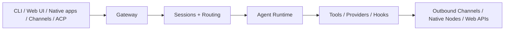
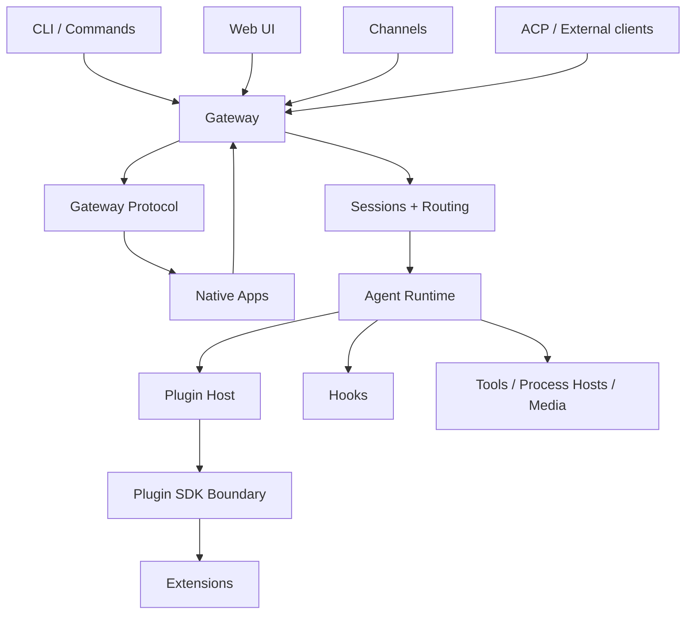

# OpenClaw Source Architecture Survey

This document summarizes a full-source survey of the OpenClaw repository. It focuses on the system's main architectural spine, the role of each major module, and the relationships between the control plane, agent runtime, plugin SDK, extensions, and client surfaces.

## 快速跳转 / Quick Links

- 总索引与阅读路径 / Master index: [openclaw-doc-index-and-reading-paths.md](https://github.com/simonggx/openclaw-source-architecture-survey/blob/main/openclaw-doc-index-and-reading-paths.md)
- 执行链与时序 / Execution flows: [openclaw-execution-flows.md](https://github.com/simonggx/openclaw-source-architecture-survey/blob/main/openclaw-execution-flows.md)
- 源码导读 / Source guide: [openclaw-source-guide.md](https://github.com/simonggx/openclaw-source-architecture-survey/blob/main/openclaw-source-guide.md)
- 分层架构图 / Layered architecture: [openclaw-layered-architecture.md](https://github.com/simonggx/openclaw-source-architecture-survey/blob/main/openclaw-layered-architecture.md)

## Executive summary

OpenClaw is best understood as a **gateway-centric, plugin-extended AI agent platform**.

It is not organized as a single chat app or a thin CLI wrapper around one model provider. Instead, the repository centers around four major architectural layers:

1. **Gateway control plane** in `src/gateway/`
2. **Agent/session execution runtime** in `src/agents/`, `src/sessions/`, and `src/routing/`
3. **Plugin host + public SDK boundary** in `src/plugins/` and `src/plugin-sdk/`
4. **Product and integration surfaces** in `extensions/`, `ui/`, `apps/`, and `Swabble/`

At a high level, the runtime flow is:

## Repository shape

OpenClaw is a `pnpm` monorepo. The workspace is defined in `pnpm-workspace.yaml` and includes:

- root package `.`
- `ui`
- `packages/*`
- `extensions/*`

The top-level directories have distinct responsibilities:

| Path | Role |
| --- | --- |
| `src/` | Core runtime, gateway, agent engine, config, security, plugin host |
| `extensions/` | Bundled plugin ecosystem: channels, providers, multimodal, tools, memory |
| `packages/` | Internal support packages and compatibility shims |
| `ui/` | Browser-based Control UI |
| `apps/` | Android, iOS, macOS native clients and shared Apple SDK |
| `Swabble/` | Swift wake-word / local voice tooling project |
| `docs/` | Public architecture, protocol, plugin, platform, and operations docs |

## Core architectural spine

## 1. Gateway control plane

相关深挖 / Related deep dive: [openclaw-gateway-deep-dive.md](https://github.com/simonggx/openclaw-source-architecture-survey/blob/main/openclaw-gateway-deep-dive.md)

The Gateway is the system center.

The architecture docs describe it as a single long-lived process that owns messaging surfaces, client connections, node connections, and HTTP/WS endpoints. The implementation in `src/gateway/` confirms that the Gateway is responsible for:

- WebSocket protocol serving
- HTTP APIs and health probes
- Control UI asset serving
- plugin route hosting
- node/device connectivity
- session and chat request entry
- auth, pairing, and security checks
- OpenAI/OpenResponses-compatible HTTP surfaces

Key files:

- `src/gateway/server-http.ts`
- `src/gateway/control-ui.ts`
- `src/gateway/boot.ts`
- `src/gateway/protocol/schema.ts`
- `docs/concepts/architecture.md`

The Gateway is therefore both:

- an **ingress layer** for humans, clients, channels, and nodes
- a **coordination layer** for the rest of the runtime

## 2. Agent runtime

相关深挖 / Related deep dive: [openclaw-agents-deep-dive.md](https://github.com/simonggx/openclaw-source-architecture-survey/blob/main/openclaw-agents-deep-dive.md)

The second major spine is `src/agents/`.

This directory is large because it does far more than simple prompt dispatch. It contains the execution machinery for:

- agent runs and orchestration
- model/provider resolution
- auth profile selection
- tool execution and process hosts
- context assembly and compaction
- failover and fallback handling
- MCP/ACP transport support
- execution approvals and run policies

This is the part of the system that actually turns a session request into model output plus tool use.

In practice, the runtime split is:

- **Gateway** decides where work enters and how it is tracked
- **Agents** decide how that work is executed

## 3. Sessions and routing

相关深挖 / Related deep dive: [openclaw-sessions-routing-auto-reply-deep-dive.md](https://github.com/simonggx/openclaw-source-architecture-survey/blob/main/openclaw-sessions-routing-auto-reply-deep-dive.md)

OpenClaw is a multi-channel, multi-agent, multi-account system, so a dedicated session/routing layer is essential.

Important directories:

- `src/sessions/`
- `src/routing/`

These modules handle:

- session key and session id resolution
- transcript lifecycle events
- model/provider/session overrides
- account and route lookup
- continuity across channels and clients

They are the bridge between inbound identity and runtime execution. Without them, the platform could not safely multiplex one Gateway across many channels, operators, and agents.

## 4. Plugin host and SDK boundary

相关深挖 / Related deep dive: [openclaw-plugin-system-deep-dive.md](https://github.com/simonggx/openclaw-source-architecture-survey/blob/main/openclaw-plugin-system-deep-dive.md)

This is the defining OpenClaw design choice.

### `src/plugins/`

The plugin host owns:

- discovery
- manifest loading
- enablement and validation
- runtime loading
- registry assembly
- registration of tools, providers, channels, services, hooks, routes, and commands

`src/plugins/registry.ts` shows the true width of the plugin model. Plugins can register:

- tools
- hooks and typed hooks
- channels
- provider families
- speech / realtime voice / realtime transcription
- media understanding
- image and video generation
- web fetch and web search
- memory embedding providers
- gateway handlers and HTTP routes
- services and CLI commands

### `src/plugin-sdk/`

This is the **public contract** between core and plugins.

The repository's own boundary documentation is explicit: plugin authors should consume `openclaw/plugin-sdk/*`, not private internals under `src/channels/**`, `src/plugins/**`, or `src/agents/**`.

The root `package.json` exports a very large set of `./plugin-sdk/*` subpaths, which shows that OpenClaw is intentionally maintaining a wide, named host API for bundled and third-party extensions.

This split is crucial:

- `src/plugins/` = host-owned loading and registry internals
- `src/plugin-sdk/` = stable plugin-facing seam

## Major subsystem breakdown

## CLI and command surfaces

### `src/cli/`

This layer owns command-line parsing and top-level command registration.

It starts or configures core runtime surfaces such as:

- gateway
- node/device commands
- plugins
- models
- channels
- TUI
- secrets and security tooling

### `src/commands/`

This layer sits one step deeper than CLI parsing. It implements command semantics:

- `agent`
- `channels`
- `configure`
- `doctor`
- `gateway-status`
- `models`
- `auth-choice`
- `flows`

The practical difference is:

- `cli/` maps argv into actions
- `commands/` performs the actual orchestration against config, plugins, gateway, and runtime

## Channel system

OpenClaw treats channels as first-class architecture, but the implementation is split between internal channel core and plugin-owned channel logic.

The boundary docs in `src/channels/AGENTS.md` state that `src/channels/**` is internal core implementation and that extensions should go through the plugin SDK channel contracts instead.

The current architecture looks like this:

- core owns shared message tool hosting, bookkeeping, and dispatch
- channel plugins own platform-specific action discovery and execution
- routing and session identity are passed into channel-owned execution seams

This lets OpenClaw preserve one core message surface while still supporting channel-specific behavior for Telegram, Slack, Discord, WhatsApp, Matrix, and others.

## Auto-reply and message dispatch

`src/auto-reply/` is where inbound messages become runtime work.

That layer resolves:

- whether a message should trigger a reply
- which session/account/agent should receive it
- how to invoke the agent runtime
- how to shape the outbound reply

Architecturally, it is the bridge from channel ingress to agent execution.

## Hooks

`src/hooks/` provides lifecycle extensibility.

This layer allows custom behavior around events such as:

- before agent start
- before model resolution
- before tool call
- installation/setup lifecycle
- after tool execution
- prompt mutation and safety checks

That makes OpenClaw more than a plugin registry. It is also an event-driven extensibility host.

## Configuration, secrets, security, and runtime substrate

The runtime substrate lives mostly across:

- `src/config/`
- `src/secrets/`
- `src/security/`
- `src/process/`
- `src/cron/`
- `src/logging/`
- `src/runtime.ts`
- `src/global-state.ts`

These modules form the operational base layer of the platform.

### Config

The config system supports:

- runtime snapshots
- schema validation
- config IO and mutation
- plugin-aware validation and schema expansion

### Secrets

The secrets layer supports multiple secret sources:

- environment variables
- files
- command execution

That allows the same core runtime to work in local, server, or more locked-down deployments.

### Security

The security subsystem includes:

- config audits
- dangerous tool/config detection
- filesystem and channel security checks
- safe execution policy helpers
- auth and rate-limit support inside the Gateway

### Process and cron infrastructure

OpenClaw also includes its own runtime support for:

- supervised child processes
- PTY-backed processes
- command queues and kill-tree support
- cron-like scheduled service behavior
- structured subsystem logging

This makes the project feel more like an application platform than a single-purpose bot.

## Product and integration surfaces

## 1. Extensions ecosystem

`extensions/` is the bundled capability ecosystem.

The extensions break down into several broad groups.

### Channel and messaging plugins

Examples:

- `telegram`
- `slack`
- `discord`
- `feishu`
- `signal`
- `matrix`
- `mattermost`
- `msteams`
- `line`
- `qqbot`
- `zalo`
- `nextcloud-talk`

These provide inbound/outbound platform integration, account setup, pairing, and message delivery behavior.

### Model and provider plugins

Examples:

- `openai`
- `anthropic`
- `google`
- `deepseek`
- `openrouter`
- `ollama`
- `mistral`
- `groq`
- `qwen`
- `minimax`
- `moonshot`
- `xai`
- `amazon-bedrock`
- `anthropic-vertex`
- `litellm`

These register text inference and other AI capability providers.

### Multimodal and media plugins

Examples:

- `browser`
- `speech-core`
- `media-understanding-core`
- `image-generation-core`
- `video-generation-core`
- `voice-call`
- `elevenlabs`
- `deepgram`
- `fal`

These implement browser automation, speech, TTS/STT, media understanding, image/video generation, and telephony-related features.

### Search, crawl, and tooling plugins

Examples:

- `exa`
- `firecrawl`
- `brave`
- `duckduckgo`
- `searxng`
- `tavily`
- `diffs`
- `diagnostics-otel`

### Memory and knowledge plugins

Examples:

- `memory-core`
- `memory-lancedb`
- `open-prose`
- `synthetic`

Together these show that `extensions/` is not a small add-on area. It is the practical capability surface of the platform.

## 2. Internal support packages

`packages/` currently serves a narrower support role.

Important packages include:

| Package | Role |
| --- | --- |
| `plugin-package-contract` | internal package/manifest contract support |
| `memory-host-sdk` | reusable SDK for memory-related host functionality |
| `clawdbot` | compatibility shim forwarding to `openclaw` |
| `moltbot` | compatibility shim forwarding to `openclaw` |

This indicates that some subsystems, especially memory and plugin packaging, are being treated as reusable internal products.

## 3. Control UI

相关深挖 / Related deep dive: [openclaw-ui-platform-deep-dive.md](https://github.com/simonggx/openclaw-source-architecture-survey/blob/main/openclaw-ui-platform-deep-dive.md)

The web UI under `ui/` is built with:

- Vite
- Lit
- Markdown rendering and sanitization support
- Playwright/Vitest-based testing

It is not the system center. It is a **browser client of the Gateway**.

The corresponding backend glue lives in:

- `src/gateway/control-ui.ts`
- `src/gateway/server-http.ts`

Its role is operational visibility and control: chat, sessions, nodes, config, logs, and debugging.

## 4. Native clients and shared Apple SDK

相关深挖 / Related deep dive: [openclaw-ui-platform-deep-dive.md](https://github.com/simonggx/openclaw-source-architecture-survey/blob/main/openclaw-ui-platform-deep-dive.md)

### `apps/android`

Android is a native client/node surface.

It is built with Kotlin/Gradle and acts as a paired mobile node that connects to the Gateway and exposes device capabilities.

### `apps/ios`

iOS is a Swift/SwiftUI client with app, share extension, widget, and watch-related targets. It connects to the same Gateway control plane.

### `apps/macos`

macOS includes a desktop app, CLI, IPC library, and discovery support. It depends on shared Apple-side packages rather than duplicating protocol logic.

### `apps/shared/OpenClawKit`

This shared Apple package exports:

- `OpenClawProtocol`
- `OpenClawKit`
- `OpenClawChatUI`

That means the Apple clients share both protocol models and reusable UI/runtime code.

## 5. Swabble

相关深挖 / Related deep dive: [openclaw-ui-platform-deep-dive.md](https://github.com/simonggx/openclaw-source-architecture-survey/blob/main/openclaw-ui-platform-deep-dive.md)

`Swabble/` is a separate Swift project with:

- `Swabble`
- `SwabbleKit`
- `swabble` CLI

It appears to cover local wake-word / speech-related functionality that can be reused by Apple-side products.

## Inter-module relationships

The system relationships can be summarized like this:

The most important relationships are:

### Gateway ↔ sessions/routing

The Gateway receives inbound work, but it relies on sessions and routing to decide who owns that work and where it belongs.

### Sessions/routing ↔ agents

Once session/account identity is resolved, the agent runtime executes inside that context.

### Plugins ↔ gateway and agents

Plugins extend both sides of the system:

- Gateway-facing surfaces such as routes, methods, services, channel adapters
- Agent-facing surfaces such as tools, providers, memory, and multimodal capabilities

### Plugin SDK ↔ extensions

The plugin SDK is the formal seam that keeps the core host separate from plugin implementation details.

### UI/native clients ↔ Gateway protocol

The browser UI and native apps do not reach into core runtime internals. They connect through protocol and control-plane seams exposed by the Gateway.

## Architectural character

运行时底座深挖 / Runtime substrate deep dive: [openclaw-runtime-substrate-deep-dive.md](https://github.com/simonggx/openclaw-source-architecture-survey/blob/main/openclaw-runtime-substrate-deep-dive.md)

OpenClaw shows several strong design preferences.

### 1. Platform-first design

The codebase is organized like a host platform with contracts and registries, not like a single monolithic app.

### 2. Explicit public boundaries

The plugin SDK and Gateway protocol are both treated as public contracts. This reduces accidental coupling and makes the repository friendlier to ecosystem growth.

### 3. Manifest-first plugin strategy

Discovery and validation are intentionally separated from full runtime import. That allows OpenClaw to inspect plugins, validate config, and build operator UX before fully executing plugin code.

### 4. Gateway-centric control model

The Gateway is the place where channels, nodes, clients, sessions, auth, and event streams converge. That centralization simplifies control but also makes the Gateway a heavy critical subsystem.

### 5. Broad capability model

The plugin architecture is intentionally broad. Plugins can own text, speech, realtime, channels, browser flows, memory, web fetch/search, image generation, and more.

## Final assessment

OpenClaw is a **plugin-hosted, multi-channel AI Gateway platform**.

Its central technical framework is made of:

1. a **Gateway control plane**
2. an **agent execution runtime**
3. a **session/routing state layer**
4. a **plugin host plus public SDK contract**
5. a **wide bundled ecosystem of channels, providers, and multimodal capabilities**

Everything else in the repository — web UI, native apps, memory packages, compatibility shims, and voice/wake-word support — hangs off that spine.

That makes the repository architecturally closer to a small extensible operating environment for AI agents than to a single-purpose assistant app.
